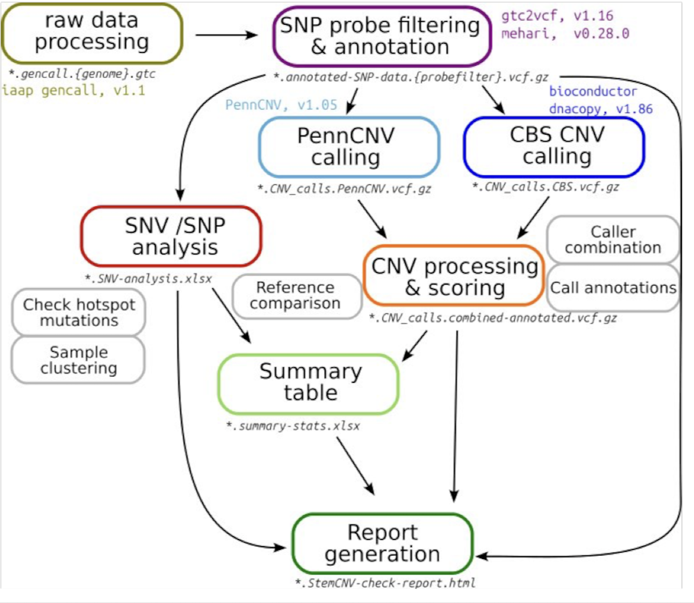

StemCNV-check Manual
===========================

StemCNV-check is a tool written to simplify copy number variation (CNV) analysis of SNP array data, specifically for quality control of (pluripotent) stem cell lines. 

**StemCNV-check applications include:**

- Quality control of hPSC genetic integrity based on CNV detection in SNP-array data 
- Detection of loss of heterozygosity
- Detection of CNVs/SNPs responsible for changes in amino acid sequence
- Identification of hPSC line and detection of swaps or cross-contamination based on comparison to reference samples,  analysis based on samples SNP distance which indicates hPSC line identity. This allows sample identification and detection of swaps  or cross-contamination 

- Evaluation of SNPs in coding regions of interest, detect  on/off target genomic changes generated after genetic engineering procedures.

StemCNV-check uses snakemake to run the complete analysis from raw data (.idat) up to report generation for all defined samples with a single command. Samples need to be defined in a (tabular) sample table and the workflow settings are defined through a yaml file.

**StemCNV-check provides:**

• Automated CNV calling and annotation, with improved quality of calls over other tools
• CNV scoring, filtering and labeling (based on Check-Score and other config file options) 
• Sample comparison based on genotypes (sample identity compared to reference and other samples based on SNP distance)
• SNV analysis (de-novo, impact estimation)
• Easily readable report in html format

**Requirements:**

- linux environment (or WSL on windows) 
- working conda (or mamba) 

Workflow overview
---------

.. toctree::
    :maxdepth: 2
    :caption: Contents:

Table of Contents
^^^^^^^^^^^^^^^^^

.. toctree::
    :maxdepth: 2
    :caption: Contents:

.. toctree::
    :maxdepth: 2
    :caption: Introduction
    :name: stemcnv_intro

    introduction
    glossary

.. toctree::
    :maxdepth: 2
    :caption: Getting started 
    :name: stemcnv_install

    installation
 
.. toctree::
    :maxdepth: 2
    :caption: Tutorial
    :name: run_stemcnv
    
    setup_project
    config
    sample_table
    output_files
    report_analysis
    

.. toctree::
    :maxdepth: 2
    :caption: FAQ
    :name: troubles_stemcnv

    trouble_shooting 

.. toctree::
    :maxdepth: 2
    :caption: Settings and advanced features  
    :name: advanced_stemcnv
    
    labels
