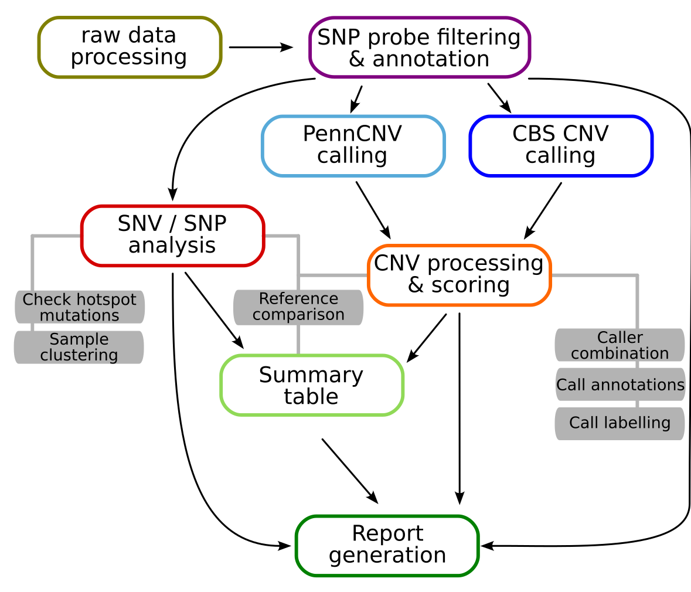

.. _intro-workflow:

Workflow description
====================

The StemCNV-check analysis workflow is designed to process Illumina SNP array data (i.e. GSA array) from raw idat files 
to a final report with CNV calls and SNP/SNV analysis. The workflow is implemented in snakemake and can be run with a 
single command once the sample table and config files are prepared and the array specific static data is generated.

The main steps of the workflow are:
  - Raw data processing

    - Conversion of idat to gtc and vcf
    - SNP probe filtering
    - SNP annotation

  - CNV calling and processing

    - CNV calling with PennCNV and CBS
    - Merging of CNV calls and comparison to reference samples
    - Annotation of CNVs, including Check-Score calculation
    - CNV labelling

  - SNP / SNV analysis

    - SNV comparison to reference samples
    - SNV filtering to protein affecting variants and labelling
    - Sample identity check based on SNP genotypes

  - Result summary
  - Report generation 

    Simplified graphic overview of the StemCNV-check workflow for a single sample

The **raw data processing** step includes the conversion of raw idat files into the gtc format and then into vcf files.
These vcf files are then extended with **SNP probe filters** to remove low quality probes and probes with known issues and 
with consequence **annotations** from mehari to enable later SNV analysis.

**CNV calling** is performed with two different algorithms, PennCNV and CBS (circular binary segmentation). 
The resulting CNV calls are then further **processed**, including merging and compared to a reference sample (if one is 
defined for a given sample), **annotation** with CNV call flags, gene overlaps, and *Check-Score*, and finally 
:ref:`labelling <tech-cnv-labels>`. CNV flagging system and *Check-Score* will be described in an upcoming publication.

The **SNP / SNV analysis** includes the comparison of SNP genotypes to allow sample identity checks. Additionally, all 
protein changing SNVs are also compared to a reference sample (if defined) and :ref:`labelled <tech-snv-labels>` based 
on potential relevance.

Finally, a result **summary** is created for each sample and all results are collected and visualised in an easily 
readable **html report**.
