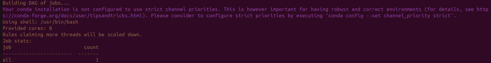
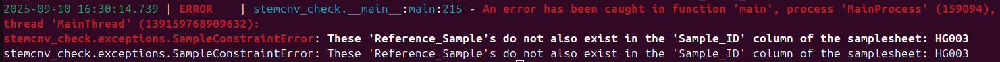
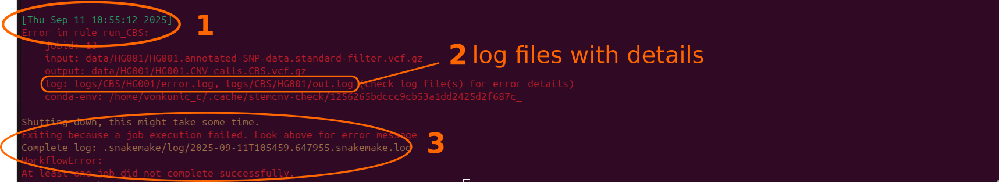

.. _issues-intro:

StemCNV-check errors
======================

The StemCNV-check workflow runs in two parts. 

First it parses the sample table and config files and prepares the actual analysis,
which is then started for the second part, which internally uses snakemake to manage the workflow.
Once the second part starts snakemake will first write "Building DAG of jobs..." and the continuous progress with individual 
steps to the terminal.

    Example of the message in the StemCNV-check log output indicating the start of snakemake.

**Errors before workflow execution by snakemake**

The most likely source of errors before the workflow starts are formatting issues  in the config or sample table files or 
values outside allowed configuration, especially including mistyped sample names. In these cases StemCNV-check should 
notify the user what problems exist, so that they can be fixed.

Please read these error messages carefully and adjust the files accordingly.  
Any error messages including or originating from the yaml (parser) packages also indicate a problem with the config file.

    Example of an error in the sample table: a non-extisting sample (HG003) was used as reference

**Errors during workflow execution by snakemake**

If the workflow fails during execution, snakemake automatically reports which step failed. If this happens there is most 
likely an unforeseen issue with the workflow, though it can also be caused by :ref:`out of memory <issues-common-memory>` 
or other system specific issues.

To help us fix such issues, please :ref:`report them <issues-support>` make sure to include the corresponding 
log files (indicated by snakemake rule error message block) when reporting the issue. Since such errors are often specific 
to the data, we may need access to your files to reproduce, understand and fix the error.

    Example of an error in the snakemake workflow. With highlights of 1) the error of a single step, 
    2) the log files important for analysing the error and 3) the final message indicating that at least one error occurred.