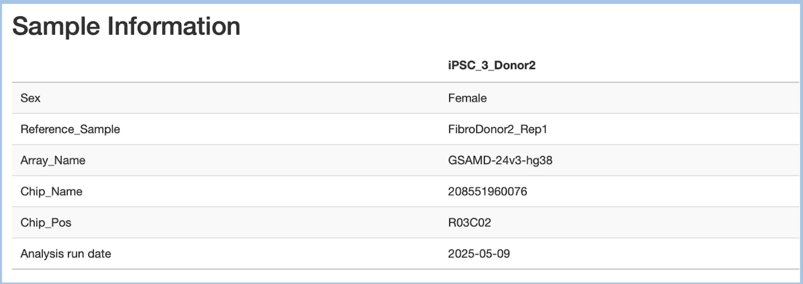
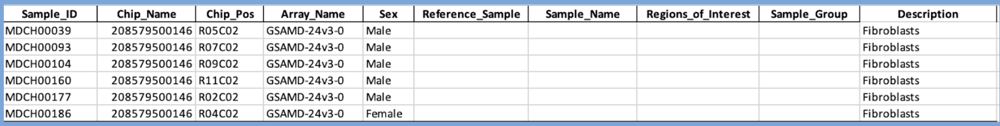
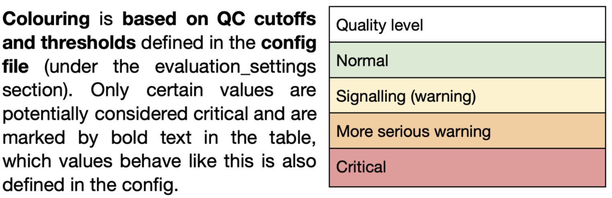
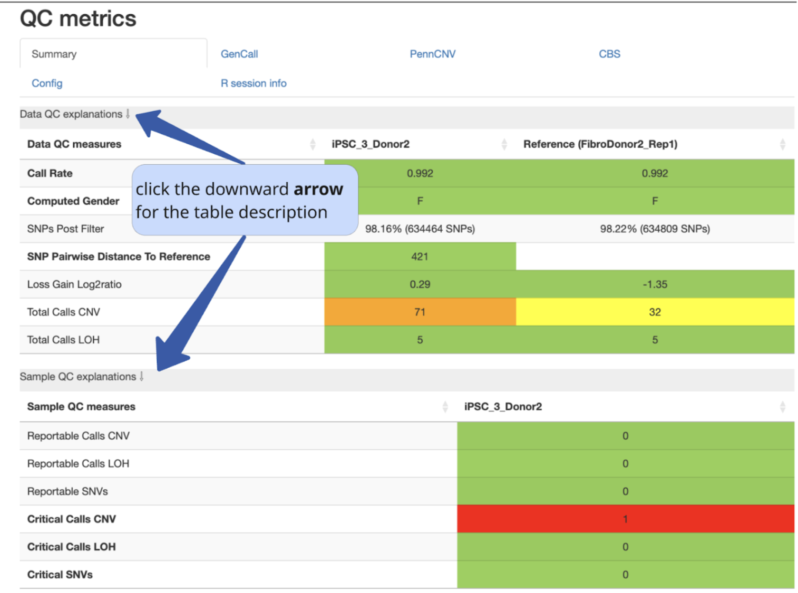
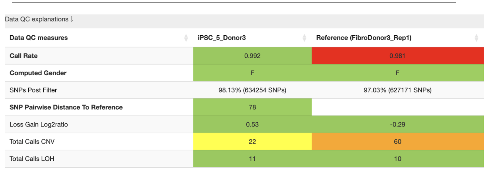
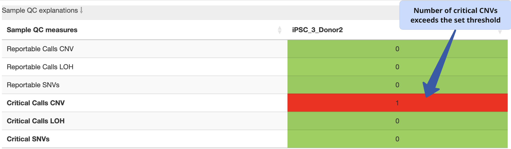

Report analysis 
===========================

Report sections       
----------------

- Sample Overview 

   - Sample information
   - QC metrics 
- CNV calling
- SNV analysis
- Sample comparison

1. Sample overview 
----------------

**Sample information table**

- Contains information from the sample table about the sample named by sample_id: Sex, Reference_Sample, Array_Name, Chip_Name, Chip_Pos

- Reference sample is the sample for comparison, it is a precursor cell line or earliest progenitor cell line for this sample with iPSC clone. It is defined by the sample id in the sample table. 

The sample table with all samples specifies the sample id and the reference for analysis of each sample. A sample table is used as input for running StemCNV-check.

**QC metrics**

- Summary (Data and Sample QC explanations)

- GenCall
- PennCNV
- CBS
- StemCNV-check utilizes both the PennCNV and CBS algorithms
- Config
- R session info

**Summary.** Data and Sample QC explanations: these summary tables are meant to serve as a quick overview of the quality of an hPSC sample. 

**Data QC explanations:** QC metrics primarily related to the SNP data quality (affected by both the DNA used and the array run itself), this table will also display values from the reference sample if possible. 

**Sample QC explanations:** QC metrics related to the potentially problematic CNVs and SNVs identified in only the analysed sample. This table sums up all variant findings from the analysed sample, which were flagged as critical or reportable.

Note that in contrast to general SNP probes on the array, only those single variants that actually show an alternative allele and affect a protein are considered SNVs by StemCNV-check. Variants that match the genotype of assigned reference samples are never considered critical or reportable.

Data QC measures table
===========================

**Threshold measures set in the config file (can be changed by user):**

**call rate**: [0.99, 0.99]

**SNP_pairwise_distance_to_reference:** [500, 5000] 
It is based on the array platform
[500,5000] for GSA array (~700k probes)
    **loss_gain_log2ratio:** [2, 4]
    **total_calls_CNV:** [10, 50]
    **total_calls_LOH:** [30, 75]
    **reportable_calls_CNV:** [5, 10]
    **reportable_calls_LOH:** [5, 10]
    **critical_calls_CNV:** [1, 1]
    **critical_calls_LOH:** [1, 1]
    **reportable_SNVs:** [5, 10]
    **critical_SNVs:** [1, 1]

