.. _steps5-report-analysis:

Report sections       
^^^^^^^^^^^^^^^

    - Sample Overview
       - Sample information
       - QC metrics 
    - CNV calling
    - SNV analysis
    - Sample comparison

1. Sample overview 
==================

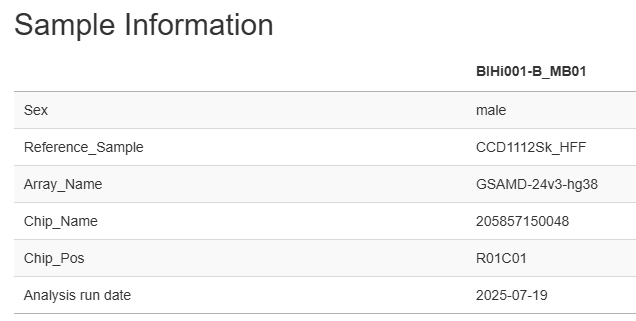

**Sample information**

- Contains information from the sample table about the sample named by sample_id: Sex, Reference_Sample, Array_Name, Chip_Name, Chip_Pos

- Reference sample is the sample for comparison, it is a precursor cell line or earliest progenitor cell line for this sample with iPSC clone. It is defined by the sample id in the sample table. 

   .. image:: _static/report_analysis/sample_table.png
      :width: 600
The sample table with all samples specifies the sample id and the reference for analysis of each sample. A sample table is used as input for running StemCNV-check.

QC measures 
-----------

- **Summary** with two tables (Data and Sample QC explanation)Data and Sample QC explanations: these summary tables are meant to serve as a quick overview of the quality of an hPSC sample. 

   **Data QC explanations:** QC metrics primarily related to the SNP data quality (affected by both the DNA used and the array run itself), this table will also display values from the reference sample if possible. 
   
   **Sample QC explanations:** QC metrics related to the potentially problematic CNVs and SNVs identified in only the analysed sample. This table sums up all variant findings from the analysed sample, which were flagged as critical or reportable.
   
   Note that in contrast to general SNP probes on the array, only those single variants that actually show an alternative allele and affect a protein are considered SNVs by StemCNV-check. Variants that match the genotype of assigned reference samples are never considered critical or reportable.

- **GenCall** (Illumina genotyping algorythm)

- **PennCNV and CBS** (two CNV calling algorithms utilized by StemCNV-check)
- **Config** (file with analysis parameters)

- **R session info** (output from terminal in R, useful for determining errors)

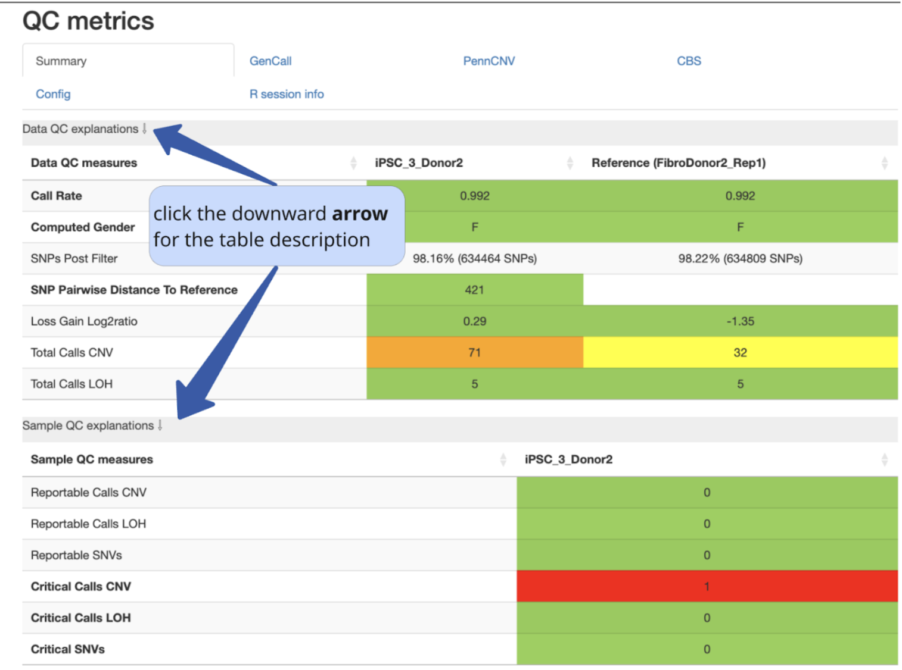
                                          
 .. image:: _static/report_analysis/coloring.png
   :width: 500

Data QC explanation 
-------------------

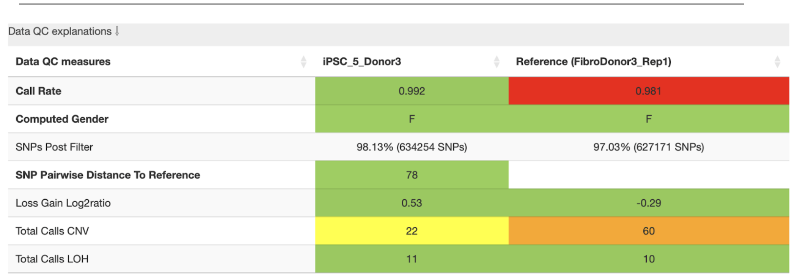

- **Call rate** is % of loci (SNP, CNV) genotyped for the sample. Call rate > 0.99 (default threshold), indicates good-quality data.

   For high-quality data 99.5% call rate is expected. However, accuracy is highly sample dependent. When samples do not perform as expected, experimenters can choose to reprocess these samples to confirm or potentially improve results. Poorly performing samples can be systematically excluded from the project. 

   .. image:: _static/report_analysis/call_rate.png
      :width: 200

- **Computed gender:** M (male) or F (female), should match the value in “Sex” column from the sample table;

- **SNPs Post Filter:** “good quality” SNPs that passed the QC thresholds;

- **SNP Pairwise distance to reference:** absolute GT distance between a sample and its reference. It reflects the similarity between the two cell lines. The smaller the distance (number of different SNPs) the smaller the phylogenetic distance (higher genetic relation between the samples).

- **Total calls CNV:** number of CNVs detected.
 | **CNVs** (copy number variation) are increases or decreases in chromosomal copies for a given region in the genome;
- **Total calls LOH:** number of LOH regions detected 
 | **LOH (loss of heterozygosity):** a region that no longer has two different alleles has a LOH;
 | **Homozygosity:** a locus can duplicate one chromosome and transpose it to the other chromosome;
 | **Hemizygosity:** a region can be deleted entirely, leaving only one chromosomal copy;

- **Loss Gain Log2 ratio** 

.. list-table::  
   :widths: 50 50
   :header-rows: 0

   * - Log2 Ratio = 0
     - SNP has the expected copy number (usually two in a diploid genome)
   
   * - Log2 Ratio > 0
     - Indicates a gain in copy number, meaning the sample has more than two copies of the region
 
   * - Log2 Ratio < 0
     - Indicates a loss in copy number, meaning the sample has fewer than two copies of the region

**Config file  default options (thresholds):** 
Can be changed by user.

.. list-table::  
   :widths: 50 50
   :header-rows: 0

   * - **call rate** 
     - [0.99, 0.99]
   
   * - **SNP_pairwise_distance_to_reference**
     - [500, 5000], 
 
   * - **loss_gain_log2ratio**
     - [2, 4]

   * - **total_calls_CNV**
     - [10, 50]

   * - **total_calls_LOH**
     - [30, 75]
 
   * - **reportable_calls_CNV**
     - [5, 10]

   * - **reportable_calls_LOH**
     -  [5, 10]

   * - **critical_calls_CNV**
     -  [1, 1]

   * - **critical_calls_LOH**
     -  [1, 1]

   * - **reportable_SNVs**
     -  [5, 10]

   * - **critical_SNVs**
     -  [1, 1]

SNP pairwise distance to refrenrece is based on the array platform, for GSA array (~700k probes) it is [500, 5000]. 

Sample QC explanation
---------------------

- Reportable calls CNV

- Reportable calls LOH 
- Reportable SNVs
- Critical calls CNV
- Critical calls LOH 

- Critical SNVs

.. image:: _static/report_analysis/sample_qc.png
   :width: 800

| **Call frequency**: % of samples that a genotype was called for the SNP

2. CNV calling
===========================

**CNV_labels**:

- Critical de-novo (used to count critical CNVs & LOHs)

- Reportable de-novo (used to count reportable CNVs & LOHs)
- De-novo call
- Reference genotype
- Excluded call

For copy number variants (CNVs) the assigned label designation takes into account a minimum Check_Score threshold, overlap with a reference call and certain call filter flags (see below). 
| The defined CNV filter flags are:

- **min_size**: CNV call below minimum size (<1000bp)

- **min_probes**: CNV call from <5 probes
- **min_density**: CNV call with <10 probes/Mb
- **high_probe_dens**: Probe density of segment is higher than 99% of the array
- **probe_gap**: Probe coverage of segment has considerable gap (min. 33% depending on probe number - see config

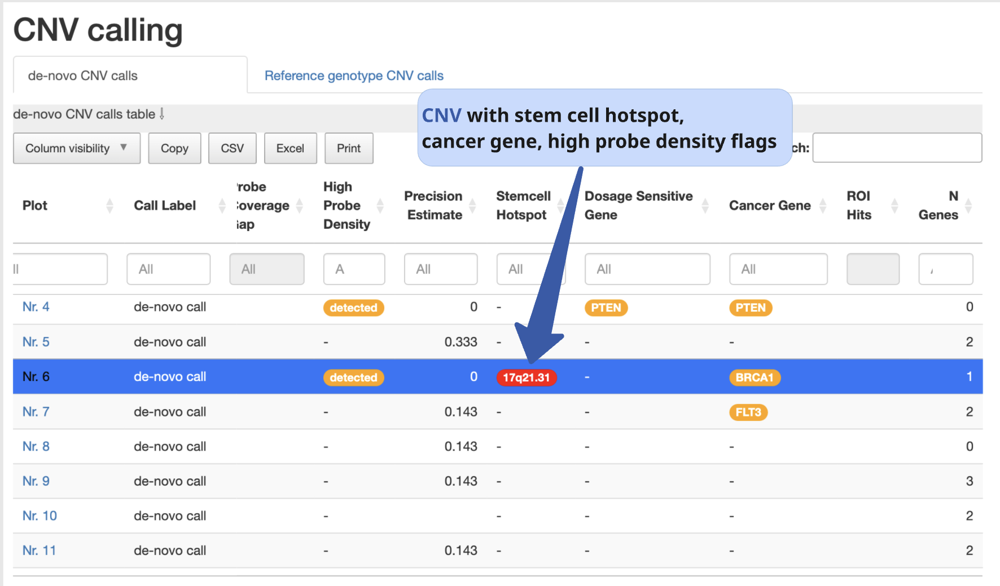

.. list-table::  
   :widths: 10 10 20 10 10 40 
   :header-rows: 1

   * - CNV_call labels
     - Minimum Check_Score
     - Exclusion filters 
     - Match with reference
     - Impact
     - Description

   * - Critical de-novo
     - ≥55
     - high_probe_dens, probe_gap, min_size, min_probes, min_density
     - No
     - High
     - Critical CNV indicate high-concern sample (de novo aberrations have impact on hPSC), biological relevance.

   * - Reportable de-novo
     - ≥55
     - min_size, min_probes, min_density
     - No
     - Middle
     - Reportable CNV - potential biological relevance, should be looked at in case they affect area of interest. 

   * - De-novo call
     - ≥ 0
     - min_size, min_probes, min_density
     - No
     - Low
     - De-novo calls meet minimal quality requirements. Don’t pass check-score threshold, little concern for QC.

   * - Reference genotype
     - ≥ 0 (any)
     - 
     - Yes
     - 
     - CNV call that matches the reference sample genotype. No concern for QC (match with germline reference or QC-passed iPSC line).

   * - Excluded call
     -  Any CNV not matching previous categories will be placed in excluded cal
     - 
     - 
     - 
     - CNVs which are indistinguishable from noise (basic filter flags: size < 1 kb or probes < 5 or probes/Mb < 10). Ignored for QC.

Interpreting BAF and LRR charts
-------------------------------

- **B allele frequency (BAF)** is the proportion of the B allele signal relative to the total signal for a SNP. In other words, BAF is a normalized measure of the allelic intensity ratio of two alleles (normalized representation of how often B allele is called). 

- **The Log R Ratio (LRR)** is a normalized measure of the total signal intensity for two alleles of the SNP (signal intensity - log R ratio).
 | Log R Ratio is a metric that normalises signal intensity for CNV analysis. It represents the number of copies relative to the normal reference sample.  
 | LRR deviation from an average of 0 **indicates a gain or a loss.**

   .. image:: _static/report_analysis/lor.png
      :width: 300

**Normal, heterozygous samples**: three distinct bands are seen. Homozygous calls are at the top (1.0) and bottom (0.0) of the chart, representing the BB and AA calls, respectively. The middle band at 0.5 represents AB, 50% of BAF in the genotype. 
When the middle band is missing while the bands at 1.0 and 0.0 remain, there is a loss of heterozygosity (LOH) BAF of 1.0 can mean either a homozygous genotype of BB or a hemizygous genotype of B [-].

- **Loss of heterozygosity (LOH)**: the middle band is missing while the bands at 1.0 and 0.0 remain. BAF of 1.0 can mean either a homozygous genotype of BB or a hemizygous genotype of B [-].
| The combination of LRR and BAF can be used to infer copy number changes in the genome. BAF charts alone can not distinguish copy neutral LOH from deletion events. That’s why it is necessary to look at the Log ratio chart simultaneously.

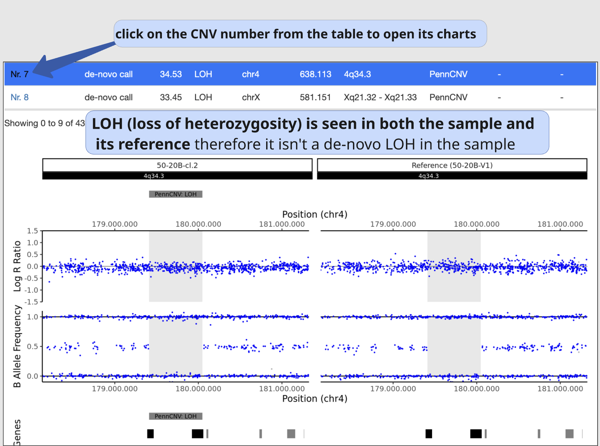

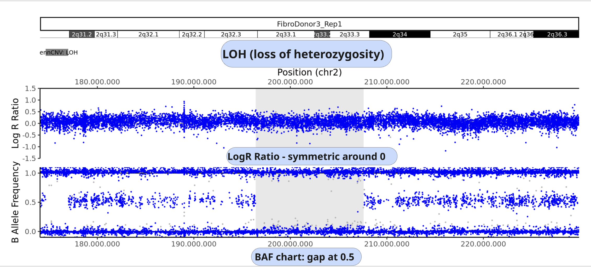

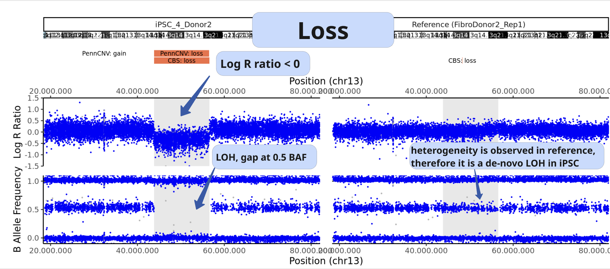

**In the case of 4 bands overall**, when there is a “split into two” of the middle band, there may be a gain, increase in copy number. 

| BAF ≈ 0.33, AAB genotype (30 % of alleles are B)
| BAF ≈ 0.67, ABB genotype (60 % of alleles are B)
| BAF ≈  0.0, AAA
| BAF ≈ 1.0, BBB 

In the case of 5 bands at BAF of 0.0, 0.25, 0.5, 0.75, 1.0 expected genotypes are AAAA, AAAB, AABB, ABBB, BBBB.

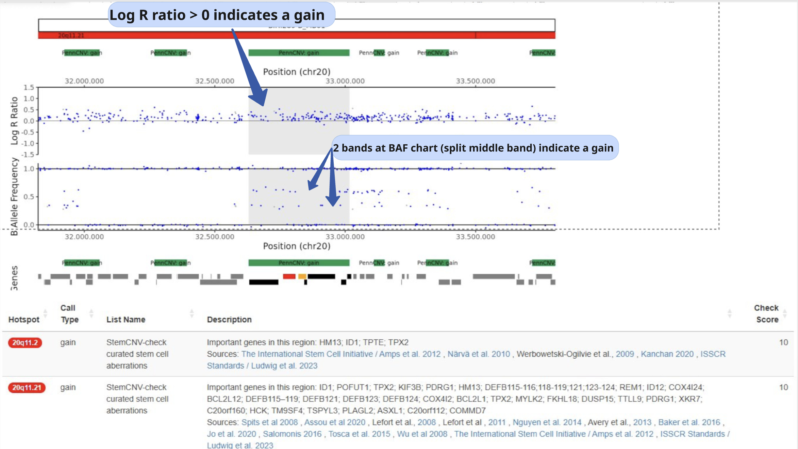

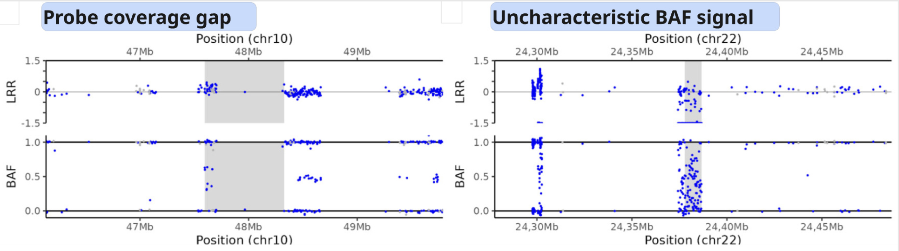

3. SNV calling
==============

The table allows sorting and filtering the SNVs by various criteria, default is sorting by the SNV Label.Hovering over the column headers gives explanations for each column and the “Column visibility” button can be used to show (or hide) columns. Each SNV genotype (GT) is shown in vcf format: each allele is represented by a single number, separated by a forward slash. A 0 indicates the reference allele, a 1 indicates the alternate allele. A dot (.) indicates that the genotype could not be determined.
This table lists all SNVs detected by the Chip Array which are different from the reference genome and are annotated as at least protein changing. Due to their potential impact these are now called “SNVs” rather than “SNPs”, independent of their actual (unknown) frequency in the population.

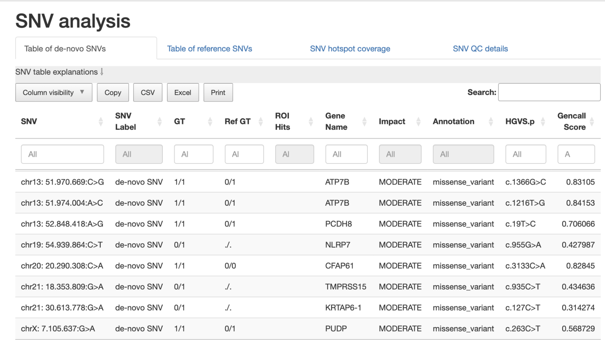

All SNVs are categorised into one of the following categories (shown in the hidden SNV category column):

- **ROI-overlap**: SNV overlapping a sample specific regions of interest

- **hotspot-match**: SNV matching a known stemcell hotspot mutation (see also SNV hotspot coverage)
- **hotspot-gene**: SNV in a gene with known iPSC hotspots (see also SNV hotspot coverage)
- **protein-ablation**: SNV (likely) fully disrupting protein function (i.e. frameshift, stop gain, stop loss)
- **protein-changing**: SNV causing a change the protein sequence (i.e. missense, inframe)
other: SNV with other unclear or undetermined effect on protein function

The “SNV label” further categorizes the SNVs into:

- **critical**: SNV with likely critical significance on hiPSC line

- **reportable**: SNV with possible significance on hiPSC line
- **unreliable critical/reportable**: SNV with likely or possible significance on hiPSC line, but unreliable signal
- **de-novo SNV**: SNV with de-novo status, but no clear functional impact
- **reference genotype**: SNV already detected in the reference sample

The following criteria are used to assign SNVs as critical or reportable:

.. list-table::  
   :widths: 50 50
   :header-rows: 0

   * - Critical SNVs
     - Reportable SNVs 
   
   * -  ROI-overlap: SNV overlapping a sample specific regions of interest

        | hotspot-match: SNV matching a known stemcell hotspot mutation (see also SNV hotspot coverage)
     -  hotspot-gene: SNV in a gene with known iPSC hotspots (see also SNV hotspot coverage)

        | protein-ablation: SNV (likely) fully disrupting protein function (i.e. frameshift, stop gain, stop loss)

4. Sample comparison
====================

Genome overview
--------
This section provides a whole chromosome overview of the sample. 
CNV calls (filtered based on the config settings) are shown on chromosomes as coloured stripes 

.. role:: red
   :red:`red for losses`

.. role:: grey
   :grey:`grey for LOH`

.. role:: green 
   :green:`green for gains`
   
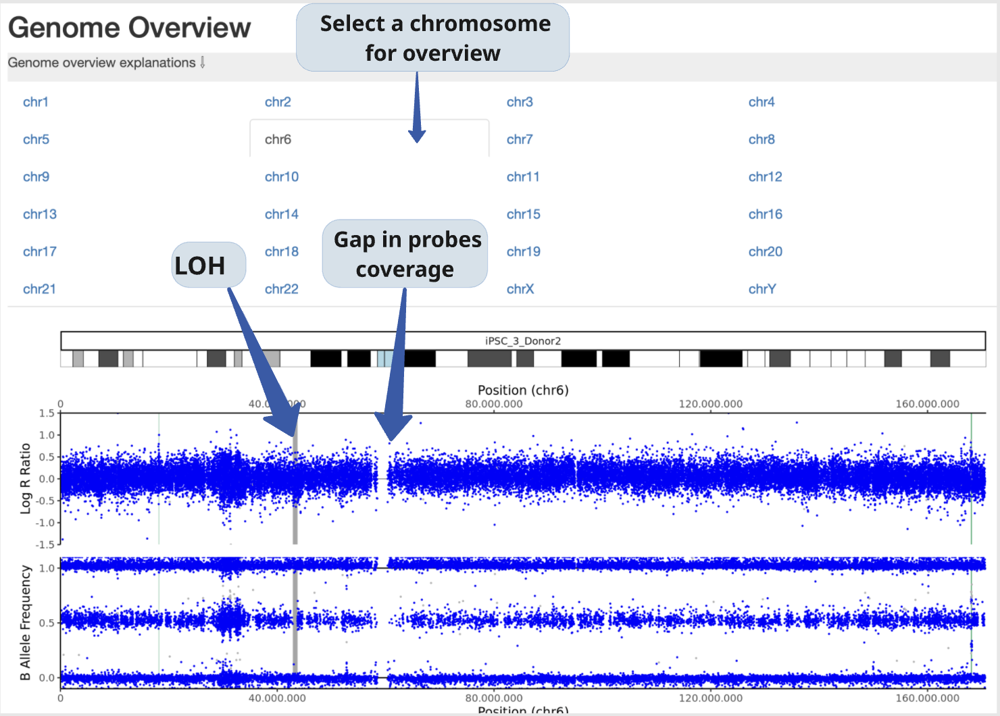

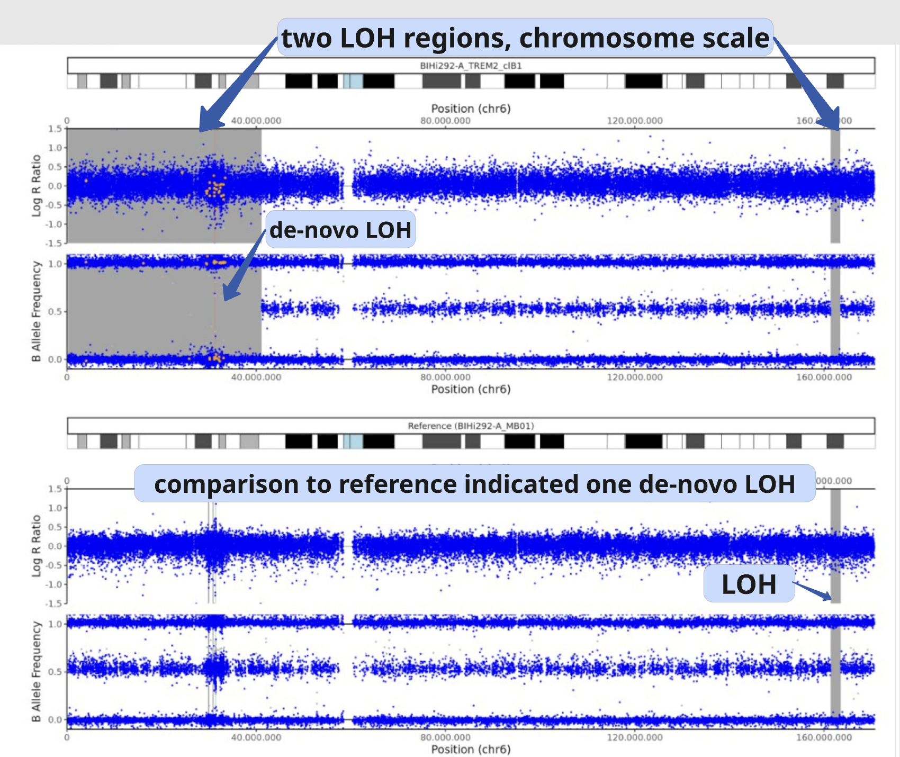

Dendrogram, clustering based on SNP analysis 
--------
Sample identities can be compared based on the dendrogram built on the SNP genotypes.

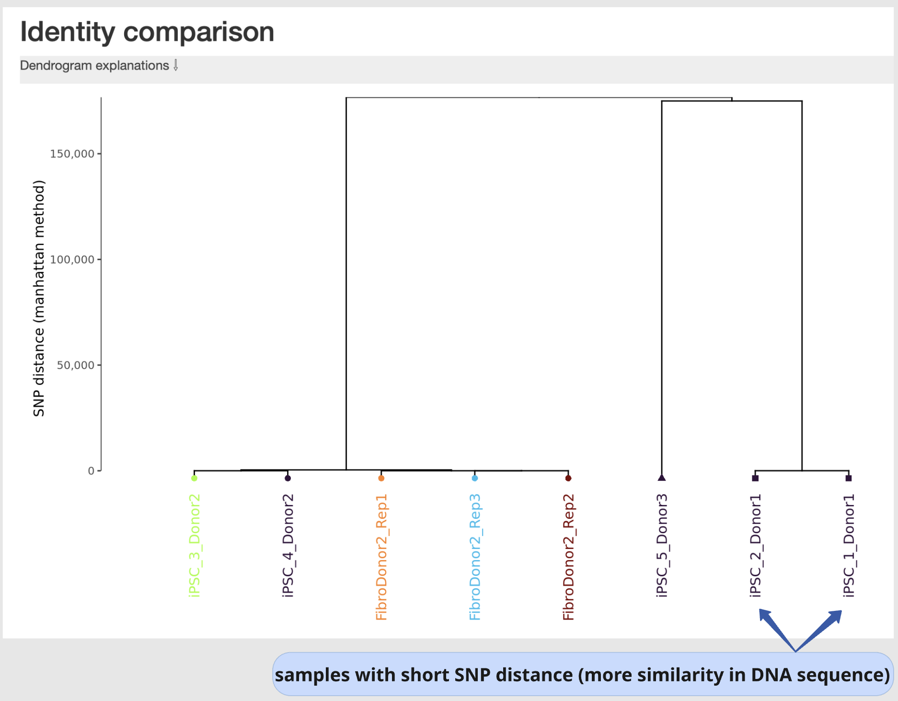

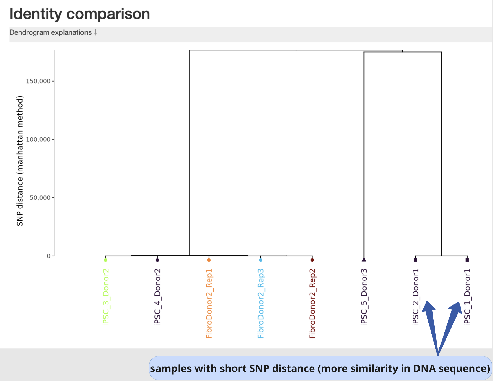

 The dendrogram is built using the manhattan distance between samples, counting both alleles from Probes that are not quality in every included sample. Accordingly, the distance between two samples is the sum of the absolute differences between the two alleles at each SNP (also shown in the table below) after QC filters. Samples that are very close together are likely identical or clonally related. Sample selection as well as color and shape labels are controlled by the config file.

**The user can indicate reference samples as a list of sample_ids to calculate the distances by typing them in the config file under section ‘SHP_clustering’, ‘sample_ids’.**

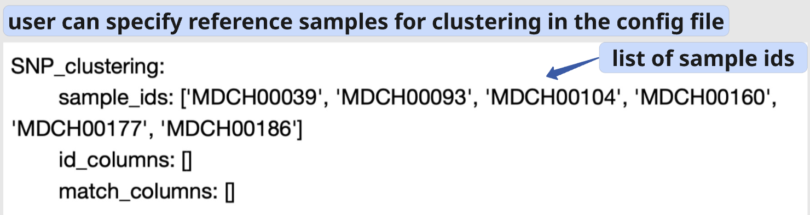

**sample_ids** are potential “precursor” samples distances to which will be calculated for each sample. These sample-IDs are from the sample table and will be added to the clustering of every sample.

