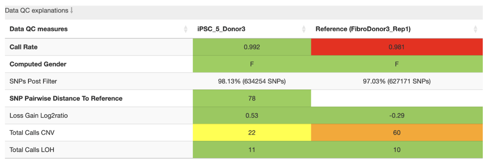
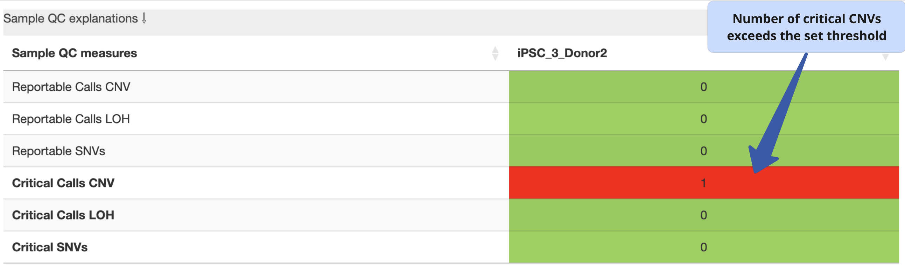

.. _steps5-report-analysis:

Report interpretation  
^^^^^^^^^^^^^^^^^^^^^

These tutorial section enable users to navigate the html report assembled by StemCNV-check and interpret the results. 
For a better understanding we suggest the simultaneous reading of this tutorial and the example report here provided: 
`download link <TODO>`_

**Generalities**

html report can be navigated using the interactive index shown on the left side.

.. image:: _static/report_analysis/html_navbar.png
   :width: 200 

The StemCNV-check html report includes several interactive features designed to help users interpret and explore the results more effectively:

- **Expandable information panels**
  Many sections include collapsible panels that provide definitions and explain the purpose of the section you are viewing. 
  These can be accessed by clicking on grey-highlighted titles with arrows (e.g. :bg-gray:`Data QC explanations⇩`).

- **Tab navigation links**
  The report contains links that allow quick navigation between tabs, offering an overview of available results. 

- **External resource hyperlinks**
  When relevant, the report includes clickable links to external databases (e.g., **NCBI**, **GTEx**, **Ensembl**) or 
  scientific literature references. These are typically associated with specific genes or known hPSC-associated CNV hotspots, 
  providing deeper context for the observed aberrations.

**Abbreviations:**

- **QC**: quality control
- **CNV**: copy number variation 
- **SNP**: single nucleotide polymorfism
- **SNV**: single nucleotide variation 
- **LOH**: loss of heterozygosity 
- **BAF**: B allele frequency 
- **LRR**: Log R Ratio 
- **ROI**: region of interest

1. Sample overview 
==================

Sample information
------------------

This section displays a table containing sample and run details including sample ID, sex, reference sample, array type, 
chip name and position and the date of the run.

.. image:: _static/report_analysis/sample_info.png
   :width: 400

Information displayed is retrieved from “sample table” used as input for running StemCNV-check.

.. csv-table:: 
    :header-rows: 1
    :file: _static/report_analysis/Sample_table_example.csv

.. note:: **Reference sample**

    The example above uses immediate parental control hPSC line as reference of sample analysed. 
    Additionally, for clones derived from gene editing a ROI containing the gene modified is indicated. 
    Any CNV detected in the ROI will be reported by StemCNV-check.

QC metrics 
----------

Users can navigate through different tabs containing direct quality metrics from GenCall, 
CNV calling statistics for PennCNV and CBS, and details of the configuration file used for the run and R session.

- **Summary**: color coded data and sample QC measure tables.
- **GenCall**: statistics for GenCall, the Illumina genotyping algorithm.
- **PennCNV** and **CBS**: statistics for the individual two CNV calling algorithms utilized by StemCNV-check
- **Config**: Complete configuration with analysis parameters, including highlighted changes from default values
- **R session info**: Summary of the R environment used for analysis and report generation, useful for reproducibility

The tab opened by default is the “Summary” displaying two different tables showing a quick overview of data and sample QC measures, respectively.
          
Data QC measures
++++++++++++++++

This table reports, if available, both sample and reference side-by-side. 
It shows metrics related to SNP data quality and call rate being an indirect measure of sample quality. 
Table fields corresponding are colour coded (yellow-orange-red) according to the (default) thresholds defined in the config file.

The user gets a quick overview of total CNV and LOH calls detected for both sample and reference.

**Example:**

In this example, the analysis shows that the reference sample has a **low call rate**, which may indicate poor data quality. 
The total number of CNVs per sample is also clearly displayed. The **yellow and orange warnings** highlight that the reference 
sample has high number of CNVs compared to sample, which—combined with the low call rate—suggests that some of these CNVs may be spurious.

If possible, *we recommend* using a higher-quality reference sample and re-running the SNP array. 
However,if the call rate would have been above the accepted threshold, users may proceed with the analysis, 
but should carefully validate the CNVs detected in the affected sample.

The individual rows are explained as follows:

- **Call rate** is the percentage of loci (SNP) genotyped for the sample. Call rate > 0.99 (default threshold), indicates good-quality data.
  For high-quality data 99.5% call rate is expected. However, accuracy is highly sample dependent. 
  When samples do not perform as expected, experimenters can choose to reprocess these samples to confirm or 
  potentially improve results. Poorly performing samples can be systematically excluded from the project. 

  .. math::
    
    \text{Call rate} = \frac{\text{called markers}}{\text{all markers}}

- **Computed gender:** M (male) or F (female), should match the value in “Sex” column from the sample table.

- **SNPs Post Filter:** “good quality” SNPs that passed the QC thresholds;

- **SNP Pairwise distance to reference:** absolute genotype distance between a sample and its reference. 
  It reflects the similarity between the two cell lines. The smaller the distance (number of different SNPs) the smaller 
  the phylogenetic distance (higher genetic relation between the samples). The evaluation of this distance may depend 
  on the array platform. The defaults are based on the GSA array (~700k probes). 

- **Loss Gain Log2 ratio:** The log2 normalised ratio between losses and gain. 
  Usually a similar number of losses and gains is expected, which would result in a value near 0. 
  Values above 0 indicate more losses, below 0 more gains. Due to log2 scaling a value of 3 would for example mean 
  :math:`2^3 = 8` times as many losses as gains.

- **Total calls CNV:** number of CNVs detected.

- **Total calls LOH:** number of LOH regions detected 

These are the default (maximum) values used to set color highlighting:

.. list-table::  
   :widths: 50 50
   :header-rows: 0

   * - **call rate** 
     - [0.99, 0.99] (minimum values)
   
   * - **SNP_pairwise_distance_to_reference**
     - [500, 5000]
 
   * - **loss_gain_log2ratio**
     - [2, 4] (absolute values)

   * - **total_calls_CNV**
     - [10, 50]

   * - **total_calls_LOH**
     - [30, 75]
 
   * - **reportable_calls_CNV**
     - [5, 10]

   * - **reportable_calls_LOH**
     -  [5, 10]

   * - **critical_calls_CNV**
     -  [1, 1]

   * - **critical_calls_LOH**
     -  [1, 1]

   * - **reportable_SNVs**
     -  [5, 10]

   * - **critical_SNVs**
     -  [1, 1]

Sample QC explanation
+++++++++++++++++++++

Overview of the number of *de novo* CNVs and SNVs with potential biological impact (reportable or critical) identified by 
StemCNV-check in the analysed sample. 

CNVs that match the genotype of reference sample are never considered critical or reportable.

**Example:**

In this example, 2 de novo CNVs (gain or loss) were detected in the sample when compared to the reference. 
The field is highlighted in red because these are critical calls with potential biological impact. 
Findings must be manually validated by user (refer to CNV calling section).

The exact conditions by which StemCNV-check uses to label CNVs are described in the :ref:`technical section <tech-cnv-labels>`

2. CNV calling
==============

In this section, users can switch between tables showing (a) de novo CNVs detected in the analysed sample and 
(b) CNVs already present in the reference sample, which are therefore not considered relevant for further 
interpretation in the context of the comparison.

CNV table overview
------------------

The CNV table is sorted by default using the **Check-Score**, prioritizing CNVs with the highest scores at the top. 
We recommend keeping this default sorting, as it reflects the potential biological relevance of the variants.

This table provides a detailed overview of key CNV characteristics, including:

- CNV type
- Chromosome location
- Size
- CNV caller used
- Probe density or probe gap coverage
- Precision estimate
- Other relevant annotations

You can customize which columns are displayed using the **“Column visibility”** button.

Additional highlights include:

- Stem cell hotspots, cancer-related, or dosage-sensitive genes overlapping a CNV are clearly marked to indicate potential biological impact.
- CNVs overlapping defined ROI are labelled as “reportable”, based on their final Check-Score.
- Hovering over any column header displays a brief tooltip with a description of that column’s content.

**Example:**

.. image:: _static/report_analysis/cnv_calling.png
   :width: 700

Even though StemCNV-check outperforms many other tools at CNV detection, still false positives or miscalling can occur, 
therefore, carefully manual validation is required to confirm the results. For this, the user must have basic 
understanding of how to interpret BAF and LRR plots.

Interpreting BAF and LRR charts
-------------------------------

LRR plots
+++++++++

**LRR** (log R ratio) is a normalized measure of the total signal intensity for probes at a SNP position.

LRR is a metric that normalises signal intensity for CNV analysis. It represents the number of copies relative to 
the normal baseline across the sample. An increase or decrease in the LRR is an indication of a copy number gain or loss respectively.

BAF plots
+++++++++

**BAF** (B allele frequency) is the proportion of the B allele signal relative to the total signal for a SNP. In other words, 
BAF is a normalized measure of the allelic intensity ratio of two alleles (normalized representation of how often B allele is called).

In most BAF plots three distinct bands are seen. The appearance of additional bands is an indicator of copy number gain, 
while disappearance of the central band indicates a loss or LOH.

*Homozygous* calls are at the top (1.0) and bottom (0.0) of the chart, representing the BB and AA calls, respectively. 

*Heterozygous*: the middle band at 0.5 represents AB indicating 50% of BAF in the genotype. 

Examples
++++++++

The combination of LRR and BAF can be used to infer copy number changes in the genome. 
BAF charts alone cannot distinguish copy neutral LOH from deletion events. 
That’s why it is necessary to look at the LRR chart simultaneously.

Example of **CNV, gain**:

 - LRR is increased from baseline
 - BAF is split into 4 distinctive bands

.. image:: _static/report_analysis/gain_chart.png
   :width: 950

Example of **CNV, loss**:

 - LRR is decreased from baseline
 - the middle BAF band is not present

.. image:: _static/report_analysis/loss_denovo.png
   :width: 950

Example of **LOH**:

 - LRR is *not changed* from baseline (copy neutral)
 - the middle BAF band is not present

Unclear BAF and LRR plots
+++++++++++++++++++++++++

Areas with a low probe coverage, including gaps, or uncharacteristic signals both in LRR and BAF plots may confuse the user for validation. 
We suggest to:

- Review and validate by importance of the call regarding *Check-Score*: users can focus first in CNVs with potential biological impact.

- When possible, always compare sample against reference  if the pattern observed for both BAF and LRR is comparable, the call is a reference call (not de novo). 

.. tip:: 

    Algorithms may detect a call in one sample and not in the other one, mostly when calls are short or present size 
    mismatch or with few probes or quality of the SNP array signals are low. By BAF and LRR comparison between sample and reference, 
    the user can easily identify false positives.
    
- Validate calls ONLY if both BAF and LRR patterns are clear at first side.

- The LRR pattern should show a clear upward or downward shift relative to the flanking regions.

- *We recommend* providing clear justifications when rejecting a CNV call during validation. 
  Documenting the reason for rejection is important for maintaining transparency and traceability in the analysis.

Examples of customized analysis interpretation:

call is not validated due to too: few probes in the area, probe gap, BAF unclear, LRR unclear, sex chromosome (less reliable calls), etc.   

3. SNV analysis
===============

In this section of the report the user can navigate through tables listing either SNV detected in the sample (de novo) 
or SNV present already in the reference sample. 

.. note::

    Unlike general SNP probes on the array, only single variants that both display an alternative allele and 
    result in a protein-coding change are classified as SNVs by StemCNV-check.

Additional tables display **SNV QC details** of the sample analysed and **SNV hotspot description** with literature sources and descriptions.

SNVs detected in the sample are listed according to SNV label (see :ref:`technical detail section <tech-snv-labels>`) 
and thus potential biological impact.

The table displays detailed information for each variant, including:
- Chromosome location
- Nucleotide change
- Genotype (compared to the reference sample)
- Overlap with hotspot genes or Regions of Interest (ROIs)
- Affected gene
- Predicted impact on protein translation

**Example**:

.. image:: _static/report_analysis/snv_analysis.png
   :width: 800

4. Sample comparison
====================

This section is divided into two subsections.

Genome overview
---------------

In this section, **BAF and LRR plots** are displayed side-by-side for the sample and its reference, covering the **entire chromosome**.

Users can navigate between chromosomes by clicking on the corresponding tabs.

This view is especially useful for validating large CNVs, which may appear as recurrent calls across different CNV detection algorithms.
   
.. image:: _static/report_analysis/genome_overview.png
   :width: 1000

**Example:**

.. image:: _static/report_analysis/loh_chromosome.png
   :width: 1000

In this example, a large de novo LOH can be validated using the full chromosome overview.

Identity comparison 
-------------------

This section displays a dendrogram including samples run in the same “sample group” (see “Sample Table in section “sample Information”). 
Sample identities can be compared based on SNP genotype distances.

This section is particularly useful to identify easily sample swaps or confirm sample identities by contrast against other samples.  

**Example:**

